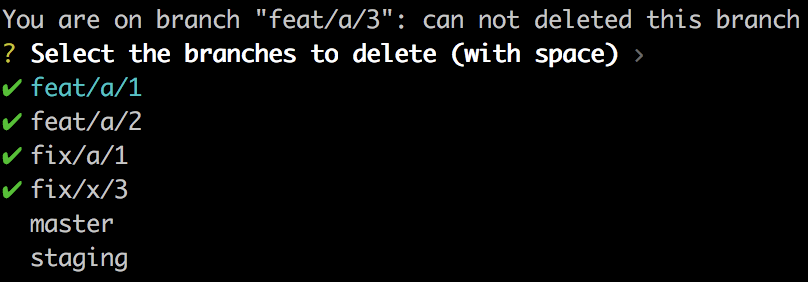

# Git branches clean (gbc)

`gbc` is a command line tool that helps you clean the local branches of a git repository on your machine.

## How it works

* Run `gbc` in a git repository



* Select the branches to delete ✅ with *space*. By default, it selects all branches except the current branch, staging, and master.

* Hit *enter*

## Installation

### On macOS

```sh
brew tap antoineprudhomme5/git_branches_clean
brew install gbc 
```
